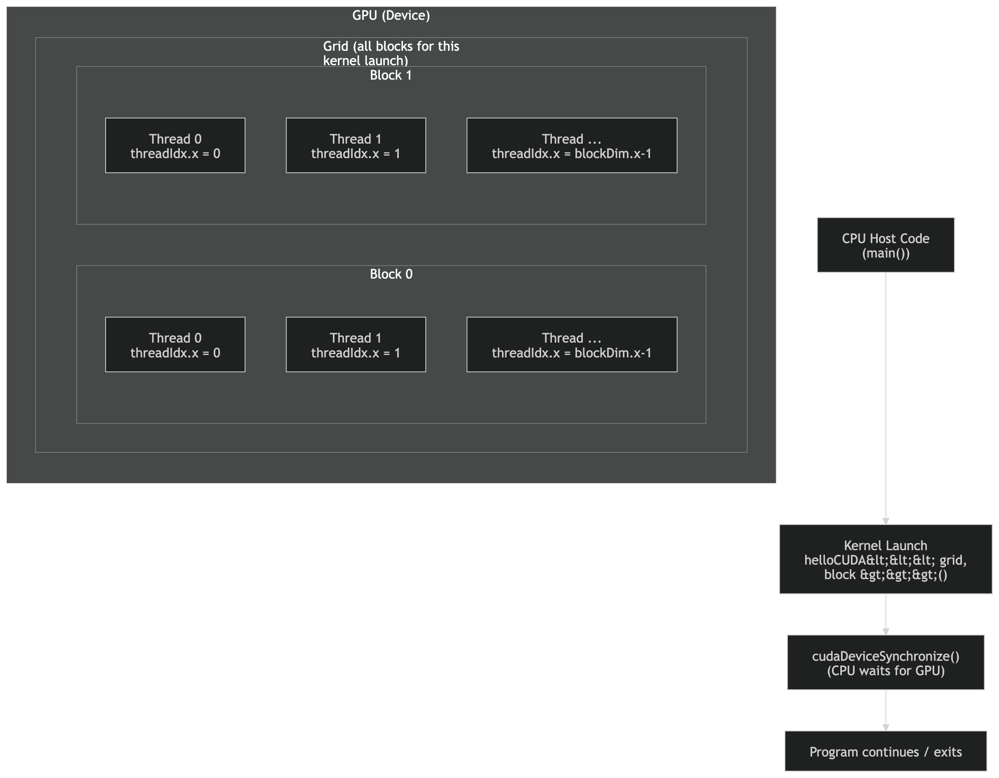

Forked from [Henry Ndubuaku](https://www.linkedin.com/in/henry-ndubuaku-7b6350b8/)  

# From zero to hero CUDA for accelerated maths and machine learning.
  
## Table of Contents

- [Introduction](#introduction)
- [What is a GPU?](#what-is-a-gpu)
- [Comparing CPU vs GPU](#Comparing-CPU-vs-GPU)
- [Parallel vs concurrent](#Parallel-vs-concurrent)
- [Process vs thread](Process-vs-thread)
- [Context switch (CPU)](Context-switch-(CPU))
- [Threads on GPU are different](Threads-on-GPU-are-different)
- [Thread challenges (CPU and GPU)](Thread-challenges-(CPU-and-GPU))
- [Memory wall (CPU and GPU)](Memory-wall-(CPU-and-GPU))
- [Overview of GPU Architecture](#overview-of-gpu-architecture)
- [Introduction to CUDA](#introduction-to-cuda)
- [The CUDA Programming Model](#the-cuda-programming-model)
  - [Kernels and Thread Hierarchy](#kernels-and-thread-hierarchy)
  - [Memory Hierarchy](#memory-hierarchy)
- [Writing CUDA Code: A Simple Example](#writing-cuda-code-a-simple-example)
- [Start tutorial](#start-tutorial)

---

## Introduction

GPUs were originally designed to accelerate graphics rendering but have evolved into powerful parallel processors capable of handling a wide range of computation-intensive tasks. By leveraging hundreds or thousands of cores, GPUs excel at executing many operations concurrently, making them ideal for high-performance computing, deep learning, scientific simulations, and more.

CUDA (Compute Unified Device Architecture) is NVIDIA’s parallel computing platform and programming model. It enables developers to harness the power of NVIDIA GPUs to accelerate their applications.

---

## What is a GPU?

A **GPU (Graphics Processing Unit)** is a specialized processor designed for parallel processing. Key points include:

- **Massively Parallel Architecture:** Consists of hundreds to thousands of small cores that perform simple computations concurrently.
- **Throughput-Oriented Design:** Optimized for executing many operations simultaneously rather than a few complex ones.
- **Diverse Applications:** Beyond graphics rendering, GPUs are used in scientific computing, machine learning, image processing, and real-time analytics.

---

## Comparing CPU vs GPU

A simple way to think about it:

- **CPU:** a few powerful cores → great for *one task at a time*, complex logic, operating system work.
- **GPU:** many smaller cores → great for *doing the same operation on lots of data*.

### Quick comparison

| CPU | GPU |
|---|---|
| Few, strong cores | Many, smaller cores |
| Optimized for **low latency** (fast response) | Optimized for **high throughput** (lots of work/sec) |
| Handles many different tasks well | Best when the same operation repeats over many elements |
| OS manages threads with **context switching** | GPU runs many threads and uses **hardware scheduling** to stay busy |
| Big caches help reduce memory delays | Many threads help **hide memory latency** |

### Parallel vs concurrent (beginner)
- **Concurrent:** tasks take turns (may overlap in time, not necessarily at the exact same moment).
- **Parallel:** tasks run at the same time (usually on multiple CPU cores, or many GPU cores).

### Process vs thread (CPU idea)
- **Process:** a running program with its own memory space (more isolation, heavier).
- **Thread:** an execution path inside a process (threads share memory → faster, but riskier).

### Context switch (CPU)
A **context switch** is when the OS pauses one thread/process and runs another.
- It saves/loads CPU state → **overhead**
- Too many switches can slow programs down

### Threads on GPU are different (CUDA idea)
- A CUDA **thread** is not the same as a CPU thread.
- CUDA threads are created in huge numbers and are **very lightweight**.
- They are organized into:
  - **Blocks** (threads that can cooperate)
  - **Grids** (collection of blocks)
- GPU scheduling is mostly hardware-driven (not OS-style time-slicing per thread).

### Thread challenges (CPU and GPU)
- **Synchronization / race condition:** if multiple threads touch the same data, timing can break correctness.
  - Example: two threads increment the same counter → result can be wrong without protection.
- **Scheduling:** performance can vary depending on which threads run when.
  - On CPU: OS scheduling affects latency/fairness.
  - On GPU: how threads map to hardware affects performance and occupancy.

### Memory wall (CPU and GPU)
Even if you have many cores, you can still be limited by memory speed:
- **CPU:** relies heavily on caches to avoid slow RAM
- **GPU:** relies on high bandwidth + many threads to hide latency
If your workload constantly waits for memory, adding more threads/cores may not speed it up much.

---


## Overview of GPU Architecture

GPUs differ from CPUs in several essential ways:

- **Many-Core Design:** GPUs include multiple Streaming Multiprocessors (SMs), each with many smaller cores.
- **SIMT Model (Single Instruction, Multiple Threads):** Multiple threads execute the same instruction on different pieces of data simultaneously.
- **Memory Hierarchy:**
  - **Global Memory:** Large capacity, accessible by all threads, but with high latency.
  - **Shared Memory:** Low-latency, fast memory accessible within a block of threads.
  - **Registers:** Very fast memory, private to each thread.
- **Latency Hiding:** GPUs keep cores busy by switching between threads to mask memory access latencies.

---

## Introduction to CUDA

CUDA is NVIDIA's parallel computing platform and application programming interface (API) that enables developers to use NVIDIA GPUs for general-purpose processing. Its main components are:

- **CUDA C/C++ Extensions:** Language enhancements for parallel kernel development.
- **Runtime and Driver APIs:** Manage GPU memory allocation, kernel launches, and synchronization.
- **Portability and Integration:** Although CUDA is specific to NVIDIA GPUs, its concepts have influenced parallel programming models on other platforms.

---

## The CUDA Programming Model

CUDA abstracts the GPU as a device capable of executing thousands of threads organized in a structured hierarchy.

### Kernels and Thread Hierarchy

- **Kernel:** A function defined to run on the GPU, marked with the `__global__` keyword.
- **Thread:** The smallest unit of execution. Each thread runs an instance of the kernel.
- **Block:** A group of threads that can share data through fast shared memory and synchronize their execution.
- **Grid:** A collection of thread blocks executing the same kernel.

**Diagram:**


### Memory Hierarchy

- **Global Memory:** High-capacity, accessible by all threads, but with higher latency.
- **Shared Memory:** Accessible only by threads within the same block, offering much lower latency.
- **Constant and Texture Memory:** Specialized spaces optimized for specific data access patterns.
- **Registers:** Fast, per-thread storage for frequently used variables.




- Your CPU code calls a kernel launch: helloCUDA<<<grid, block>>>().
- That launch starts work on the GPU.
- The GPU runs the kernel as a Grid (the whole launch).
- The Grid is split into Blocks (Block 0, Block 1, …).
- Each Block contains multiple Threads (Thread 0, Thread 1, …).
- Inside each block, threads have IDs like threadIdx.x = 0..blockDim.x-1.
- cudaDeviceSynchronize() makes the CPU wait until the GPU finishes.

---

## Writing CUDA Code: A Simple Example

Below is a minimal CUDA program written in C++:

```cpp
#include <stdio.h>

// Kernel definition: runs on the GPU
__global__ void helloCUDA() {
    // Each thread prints its thread index
    printf("Hello from GPU thread %d\n", threadIdx.x);
}

int main() {
    // Launch the kernel with 1 block of 10 threads
    helloCUDA<<<1, 10>>>();

    // Synchronize to ensure GPU execution completes before program exit
    cudaDeviceSynchronize();

    return 0;
}
```

# Start tutorials  

The files are numbered by progression order and thoroughy explained, simply read through to understand each concept, then compile and run any of the files using `nvcc <filename> -o output && ./output`, but be sure to have a GPU with the appropriate libraries installed.

